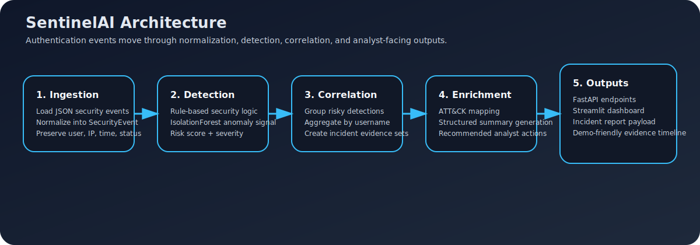
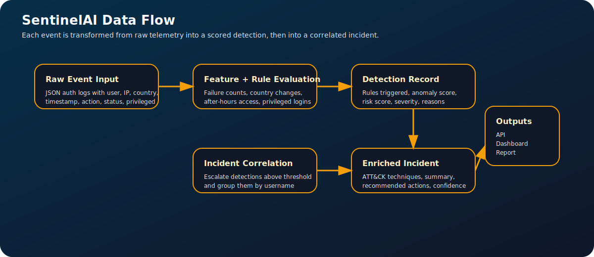

# SentinelAI: AI-Powered SOC Alert Triage Assistant


SentinelAI is a cybersecurity project that simulates how a lightweight SOC triage workflow can use AI and anomaly detection to reduce analyst effort. It ingests authentication events, detects suspicious behavior, correlates related alerts into incidents, and generates structured summaries with MITRE ATT&CK mappings and response guidance.





## Overview

SentinelAI combines several practical security workflow components in one system:

- cybersecurity thinking through real alert triage scenarios
- AI/ML skills through anomaly detection and structured enrichment
- software engineering through a FastAPI backend and Streamlit dashboard
- communication skills through explainable outputs and clean project documentation

## Core Capabilities

- Ingests sample authentication events from structured JSON
- Normalizes activity into a consistent event schema
- Detects repeated failed logins, suspicious success after failures, impossible travel, privileged access, and after-hours authentication
- Adds anomaly scores with `IsolationForest`
- Correlates suspicious detections into correlated incidents
- Generates summaries, ATT&CK mappings, and recommended triage actions
- Exposes results through a FastAPI API and Streamlit dashboard

## Architecture

1. Ingestion normalizes raw events into a common schema.
2. Detection combines rule-based logic with anomaly scoring.
3. Correlation groups suspicious events into incidents.
4. Enrichment generates summaries, ATT&CK mappings, and response guidance.
5. Presentation serves results through an API and dashboard.

See [architecture.md](/D:/sentinel-ai/docs/architecture.md) for the full architecture diagram and component breakdown.

## Repository Layout

```text
sentinel-ai/
|-- app/
|   |-- main.py
|   |-- models.py
|   |-- sample_data_loader.py
|   `-- services.py
|-- dashboard/
|   |-- app.py
|   `-- dashboard_app.py
|-- data/
|   `-- sample_auth_logs.json
|-- docs/
|   |-- architecture.md
|   `-- demo-script.md
|-- tests/
|   `-- test_pipeline.py
|-- .env.example
|-- .gitignore
|-- docker-compose.yml
|-- README.md
`-- requirements.txt
```

## Quick Start

Create and activate a virtual environment:

```bash
python -m venv .venv
.venv\Scripts\activate
```

Install dependencies:

```bash
pip install -r requirements.txt
```

Run the API:

```bash
uvicorn app.main:app --reload
```

Run the dashboard:

```bash
streamlit run dashboard/dashboard_app.py --server.headless true --browser.gatherUsageStats false
```

## API Endpoints

- `GET /health`
- `GET /events`
- `GET /detections`
- `GET /incidents`
- `GET /report`

Once the API is running, open [http://127.0.0.1:8000/docs](http://127.0.0.1:8000/docs).

## Demo Flow

A simple walkthrough:

1. Open the dashboard and show the incident count and severity distribution.
2. Open the highest-severity incident and walk through the evidence timeline.
3. Explain which detections fired and how anomaly scoring contributed.
4. Show the ATT&CK mappings and recommended analyst actions.
5. Open the API report endpoint and explain how the same results can be consumed programmatically.

See [demo-script.md](/D:/sentinel-ai/docs/demo-script.md) for a short speaking script.

## Images

The README includes architecture and data flow diagrams stored in the local `assets/` folder so GitHub renders them directly. You can still add dashboard screenshots later if you want to show the running UI.

## Roadmap

- Replace template summaries with a hosted LLM provider
- Persist events and incidents in PostgreSQL
- Add authentication and analyst feedback capture
- Extend the project with phishing email analysis as a second pipeline

## License

MIT
