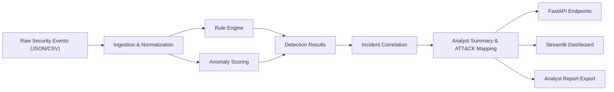

# SentinelAI Architecture

## System Overview

## Components

### Ingestion

- Converts raw security events into a normalized schema
- Standardizes timestamp, user, IP, country, hostname, action, and result fields

### Detection

- Rule engine looks for repeated login failures, impossible travel, privileged account use, and after-hours access
- Isolation Forest provides a lightweight anomaly signal that is easy to explain in interviews

### Correlation

- Groups suspicious activity by user identity
- Aggregates risk, evidence, affected IPs, and countries into a single incident view

### Enrichment

- Generates an analyst-friendly summary
- Maps triggered detections to MITRE ATT&CK
- Recommends concrete triage actions

### Presentation

- FastAPI provides machine-friendly access to events, detections, incidents, and report output
- Streamlit provides a recruiter-friendly demo surface with metrics, queue views, and evidence tables
